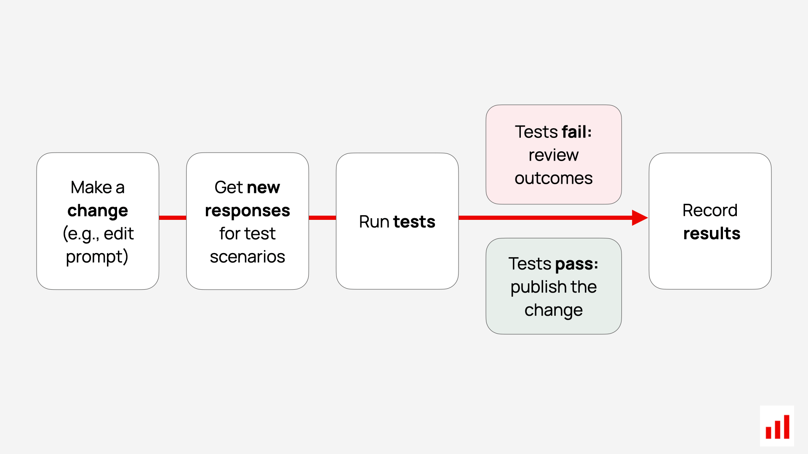
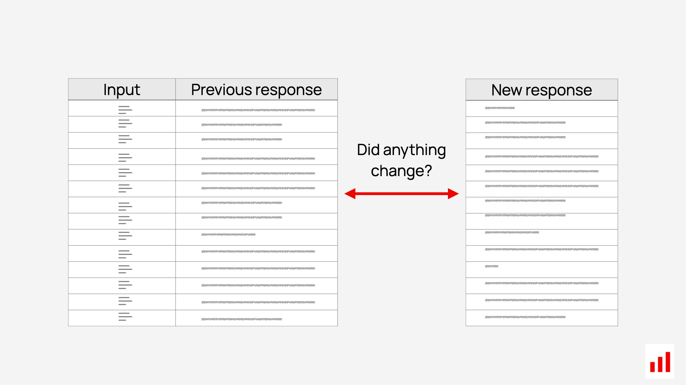

What happens when you tweak your prompt, switch model versions, or update the toolchain for your LLM agent – will the answers get better or worse? You wouldn't merge backend code without running tests. You shouldn't ship LLM code or prompt changes without validating output quality, either. Now you don’t have to. We just released a GitHub Action that lets you automatically test your LLM application outputs  – every time you push code. It runs as part of your CI workflow, using the Evidently open-source library and (optionally) Evidently Cloud. Let’s walk through what it does and how to use it.

## 🤖 Why test LLM outputs?

Developing LLM apps means constant iteration. You:

* Refactor the agent logic
* Adjust system prompts
* Swap a model or tool
* Try a few “quick” fixes…

But even tiny changes can produce regressions: less helpful responses, shorter or longer completions, or weird tone shifts. And they’re often silent – your code checks pass, but your LLM behavior changes. By running tests on your LLM or agent's outputs – not just your functions – you can catch these changes early.

Regression testing for LLM apps is one of the key [LLM evaluation workflows](https://www.evidentlyai.com/llm-guide/llm-evaluation). In this approach, you run evaluations on a pre-built test dataset to check if your AI system or agent still behaves as expected. There are two common ways to do this:

* **Reference-based evaluations:** compare the generated responses against expected ground truth answers.
* **Reference-free evaluations:** provide a set of test inputs, then automatically assess specific qualities of the responses  – such as helpfulness, tone, correctness, or length.

Think of it as unit testing – but for your LLM system’s behavior. And because language models are non-deterministic and designed to handle diverse, open-ended inputs, they’re best evaluated using structured **test datasets** rather than isolated test cases.

*Reference-based evals: comparing responses against expected ones.*