# The BEST Way to Make Your Docker Containers More Secure

***

Picture this: You’ve just shipped a new micro-service to production. The container image is lean, the CI pipeline is humming, and your dashboard shows healthy traffic. Two weeks later, a security bulletin drops—your base image contains a critical CVE that allows host escape. You now have 48 hours to patch, re-test, and re-deploy every service that inherited that layer. If this scenario feels familiar, you’re not alone. Supply-chain attacks against containers have tripled since 2021, and the average cost of remediation has crossed **USD 4.3 million per breach** (IBM Cost of a Data Breach 2024).

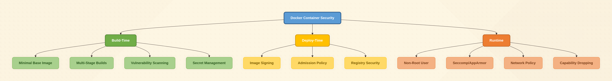

The good news? You can break the cycle. This guide walks you through a battle-tested, **layered approach** to hardening Docker containers—from choosing the right base image to runtime guardrails that even a busy startup CTO can enforce without hiring a dedicated security team. Whether you’re a non-technical founder who wants to understand the risk landscape or a senior engineer looking for copy-paste code snippets, you’ll find actionable advice in the next ten minutes.

***

## 1. Start With a Minimal, Transparent Base Image

### Why It Matters

Every instruction in your Dockerfile adds attack surface. A stock `node:20` image ships **580 packages**; an `alpine:3.19` variant ships **12**. Fewer packages mean fewer CVEs, faster scans, and smaller transfer bills.

### Quick Win (Non-Technical)

Replace:

```dockerfile
FROM node:20
```

with:

```dockerfile
FROM node:20-alpine
```

and you just shaved **\~800 MB** and **\~550 potential vulnerabilities** off the final image.

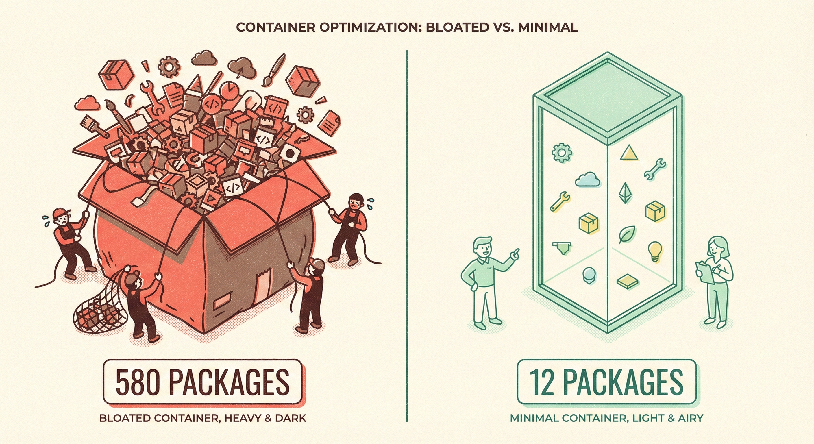

### Deep Dive (Technical)

1. Prefer images that publish **SBOMs** (Software Bill of Materials) and **SLSA Level 3 provenance**.
   Example—inspect an SBOM in CI:
   ```bash
   syft node:20-alpine -o spdx-json > sbom.spdx.json
   ```
2. Pin to a **digest**, not a tag, to guarantee immutability:
   ```dockerfile
   FROM node:20-alpine@sha256:3abc123…
   ```
3. Re-build weekly—even stable tags receive security updates. Automate with GitHub Actions:
   ```yaml
   on:
     schedule:
       - cron: '0 6 * * 1'   # Monday 6 AM UTC
   ```

***

## 2. Build Distroless or Scratch When You Can

### Why It Matters

Even Alpine contains busybox and apk, both of which had CVEs in 2024. Google’s **distroless** images contain *only* your app and runtime dependencies—no shell, no package manager, no problem.

### Quick Win

If you ship a Go binary:

```dockerfile
FROM gcr.io/distroless/static-debian12:latest
COPY myapp /
ENTRYPOINT ["/myapp"]
```

Final image size: **\~2 MB** and **zero shell**.

### Deep Dive

* Multi-stage builds keep build-time secrets out of the final image:
  ```dockerfile
  FROM golang:1.22 AS build
  WORKDIR /src
  COPY . .
  RUN CGO_ENABLED=0 go build -o myapp

  FROM gcr.io/distroless/static-debian12
  COPY --from=build /src/myapp /
  USER nonroot:nonroot
  ENTRYPOINT ["/myapp"]
  ```
* Validate the binary still works under **seccomp** and **AppArmor** profiles (see §7).

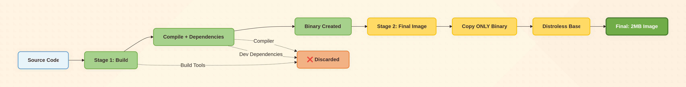

***

## 3. Never Run as Root (Even Locally)

### Why It Matters

Container breakouts usually start with root UID inside the container. Kernel exploits like **CVE-2024-21626** (leaked file descriptor) become **instant host compromise** when UID\=0.

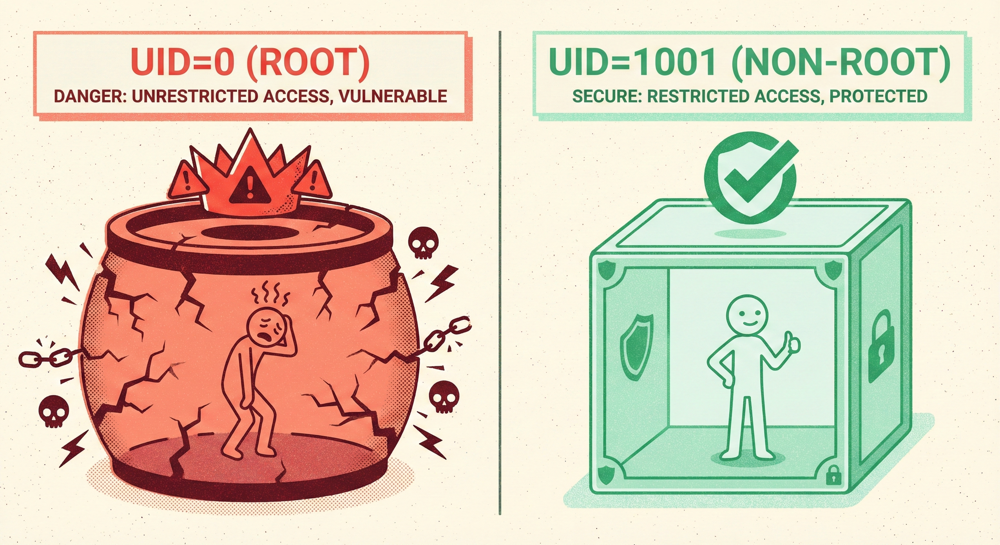

### Quick Win

Add one line to your Dockerfile:

```dockerfile
USER 1001
```

or use the distroless `nonroot` user (UID 65532).

### Deep Dive

Kubernetes overrides:

```yaml
securityContext:
  runAsNonRoot: true
  runAsUser: 1001
  allowPrivilegeEscalation: false
```

**Pro tip:** Combine with `readOnlyRootFilesystem: true` and attackers can’t drop binaries or modify `/etc/passwd`.

***

## 4. Drop All Capabilities, Then Add Back One-by-One

### Why It Matters

Linux capabilities divide root powers into 40-odd slices. Most apps need **none**; databases may need `CAP_DAC_OVERRIDE`, load-balancers `CAP_NET_BIND_SERVICE`. Default Docker grants **14 capabilities**—way too generous.

### Quick Win

Kubernetes manifest:

```yaml
securityContext:
  capabilities:
    drop: ["ALL"]
    add: ["NET_BIND_SERVICE"]   # only if you bind to port 80/443
```

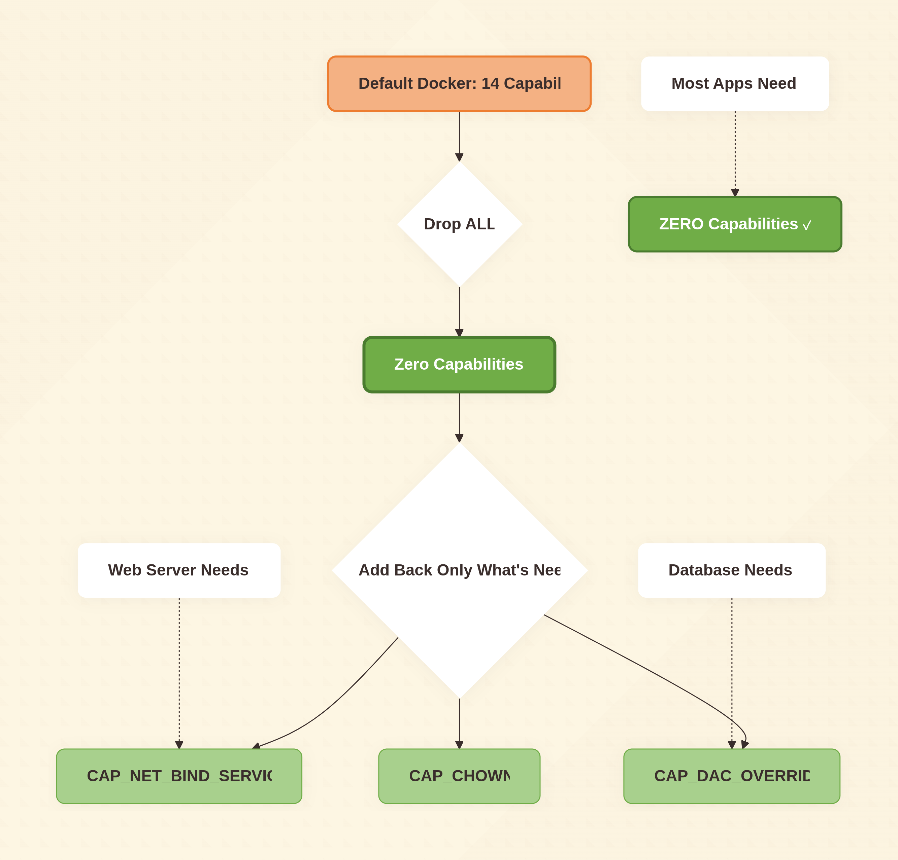

### Deep Dive

Use `strace` to discover what you *actually* need:

```bash
docker run --rm -it --cap-drop=ALL --security-opt seccomp=unconfined myimage
strace -c -f myapp
```

Add only the syscalls that fail.

***

## 5. Scan Early, Scan Often, Break the Build

### Why It Matters

A CVE caught in CI costs **1/10th** to fix versus production. Yet **49 %** of teams still scan *after* deployment (StackHawk 2024).

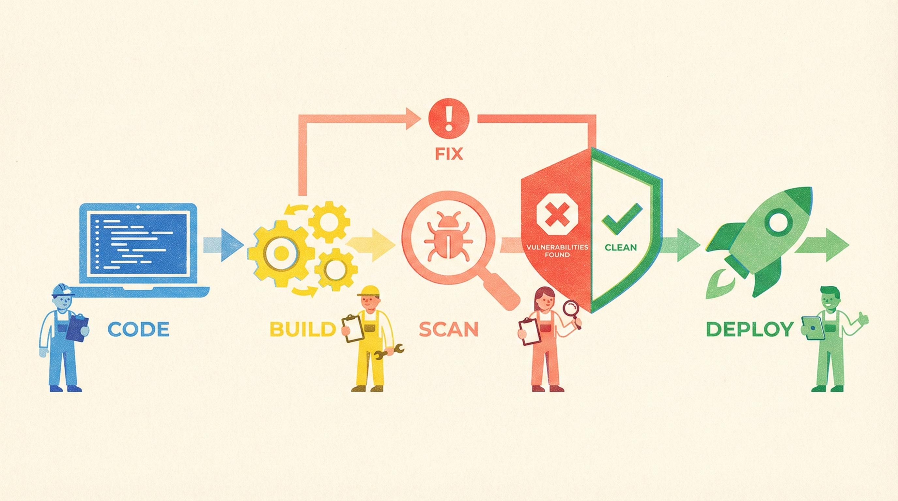

### Tooling Matrix

| Open-Source | Purpose           | CI-Friendly                 |
| ----------- | ----------------- | --------------------------- |
| **Trivy**   | Image + fs + repo | `trivy fs --exit-code 1 .`  |
| **Grype**   | Vuln + SBOM       | `grype sbom:sbom.spdx.json` |
| **Clair**   | Registry polling  | Helm chart available        |
| **Falco**   | Runtime rules     | eBPF syscall hook           |

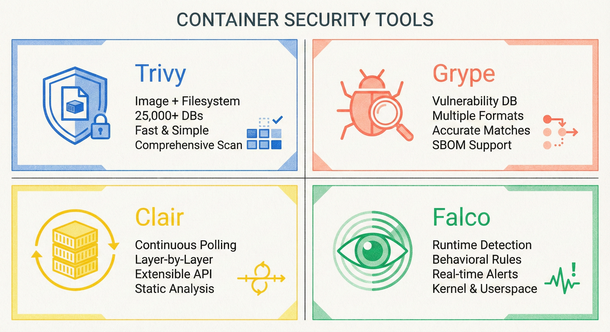

### Quick Win – GitHub Actions

```yaml
- uses: aquasecurity/trivy-action@master
  with:
    image-ref: 'ghcr.io/org/app:${{ github.sha }}'
    exit-code: '1'          # fail job on CVE
    severity: 'CRITICAL,HIGH'
```

### Deep Dive – Policy as Code

Create `.trivyignore` for *accepted* risk, version in Git.
Example:

```
CVE-2023-12345   # only affects Windows, we run Linux
```

Treat ignore entries like code comments—require PR review.

***

## 6. Sign, Verify, and Enforce Admission Policy

### Why It Matters

Supply-chain attacks don’t inject code—they *replace* images. Cosign + Kyverno/OPA Gatekeeper lets you **reject unsigned or non-attested images** at the cluster gate.

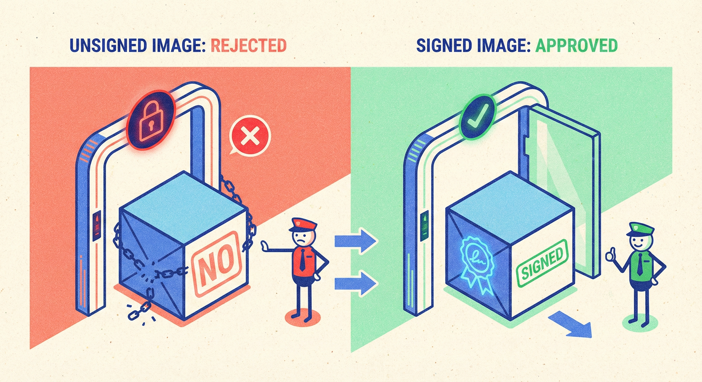

### Quick Win

1. Sign image:
   ```bash
   cosign sign --key cosign.key ghcr.io/org/app:1.2.3
   ```
2. Verify in CI:
   ```bash
   cosign verify --key cosign.pub ghcr.io/org/app:1.2.3
   ```

### Deep Dive – Kyverno ClusterPolicy

```yaml
apiVersion: kyverno.io/v1
kind: ClusterPolicy
metadata:
  name: verify-image-signature
spec:
  validationFailureAction: Enforce
  rules:
  - name: check-signature
    match:
      resources:
        kinds: ["Pod"]
    verifyImages:
    - image: "ghcr.io/org/*"
      key: |-
        -----BEGIN PUBLIC KEY-----
        ...
```

Apply once, protect every namespace.

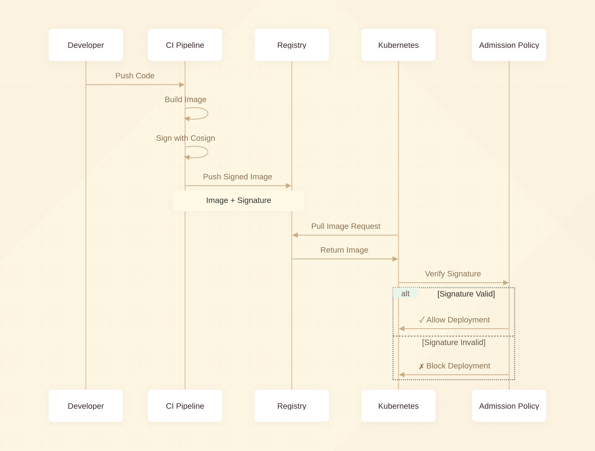

***

## 7. Runtime Armor: Seccomp, AppArmor, SELinux

### Why It Matters

Zero-day exploits *will* happen. Syscall filtering chops the kernel interface down to \~40 safe calls, slashing exploit chains.

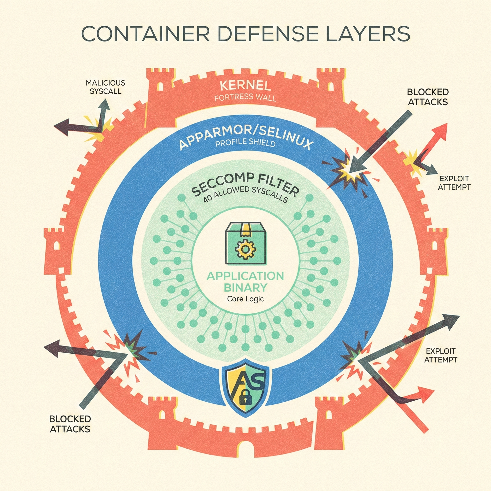

### Quick Win

Docker Desktop and most managed Kubernetes already apply **default-seccomp**. Ensure you **don’t run with `--security-opt seccomp=unconfined`** unless you profile first.

### Deep Dive

1. Generate custom profile:
   ```bash
   docker run --rm -it --security-opt seccomp=unconfined \
     --security-opt apparmor=unconfined myapp
   ```
   Use `oci-seccomp-bpf-hook` to log syscalls, then whitelist:
   ```json
   {
     "defaultAction": "SCMP_ACT_ERRNO",
     "syscalls": [
       { "names": ["accept", "bind", "clone"], "action": "SCMP_ACT_ALLOW" }
     ]
   }
   ```
2. Load into Kubernetes via **SecurityContext**:
   ```yaml
   securityContext:
     seccompProfile:
       type: Localhost
       localhostProfile: profiles/myapp.json
   ```

***

## 8. Keep Secrets Out of Layers and ENV

### Why It Matters

`docker history` shows every ENV and RUN command. One `ENV AWS_SECRET_ACCESS_KEY=xxx` and you’ve **gifted** credentials to anyone with pull access.

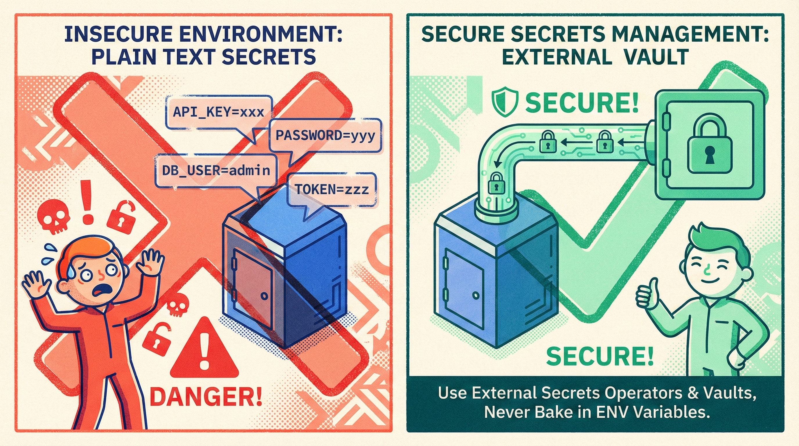

### Quick Win

Use BuildKit’s **secret mount**:

```dockerfile
# syntax=docker/dockerfile:1
RUN --mount=type=secret,id=npmrc \
    cp /run/secrets/npmrc $HOME/.npmrc && \
    npm ci && \
    rm $HOME/.npmrc
```

Build command:

```bash
DOCKER_BUILDKIT=1 docker build --secret id=npmrc,src=.npmrc .
```

### Deep Dive – Runtime Injection

* Prefer **external secret stores**: AWS Secrets Manager, Azure Key Vault, HashiCorp Vault.
* Mount via CSI driver or Secrets Store CSI; never bake into image.
* Rotate on a schedule—Kubernetes external-secrets operator makes it painless.

***

## 9. Network Segmentation Isn’t Optional

### Why It Matters

Flat networks let attackers **pivot**. A compromised frontend container shouldn’t reach the database port—yet **68 %** of breached clusters had no NetworkPolicy (Red Hat 2024 survey).

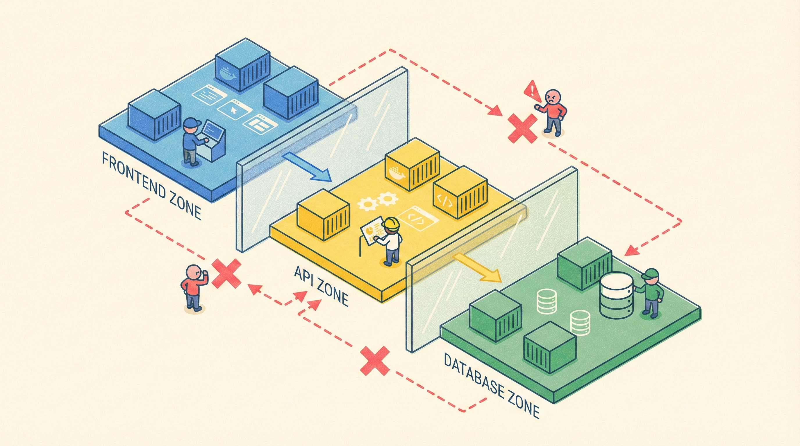

### Quick Win

Calico or Cilium ships with most managed Kubernetes. Deny-all by default:

```yaml
apiVersion: networking.k8s.io/v1
kind: NetworkPolicy
metadata:
  name: deny-all-ingress
spec:
  podSelector: {}
  policyTypes: ["Ingress"]
```

Then open **only** required labels:

```yaml
- from:
  - podSelector:
      matchLabels:
        app: api
  ports:
  - protocol: TCP
    port: 5432
```

### Deep Dive – Service Mesh Sidecars

If you need **mTLS** between micro-services, Istio or Linkerd can encrypt traffic without code changes. **Traffic permissions** (AuthorizationPolicy) replace IP-based firewall rules with identity-based rules:

```yaml
apiVersion: security.istio.io/v1beta1
kind: AuthorizationPolicy
metadata:
  name: frontend-to-api
spec:
  selector:
    matchLabels:
      app: api
  rules:
  - from:
    - source:
        principals: ["cluster.local/ns/default/sa/frontend"]
```

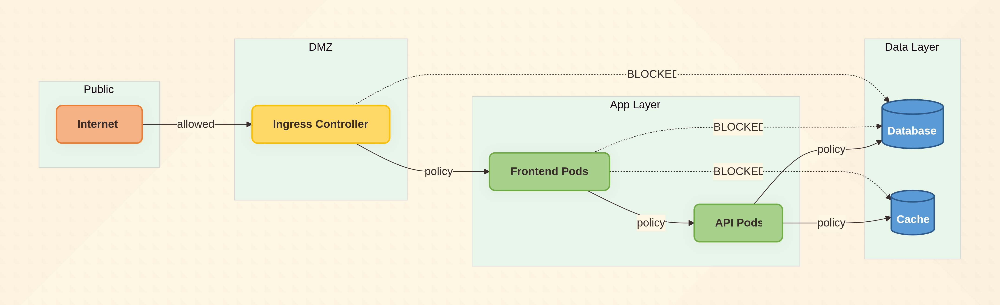

***

## 10. Continuous Red-Team Validation

### Why It Matters

Compliance checklists lag real threats. Tools like **kube-score**, **kubesec**, and **Popeye** spot mis-configurations before pentesters do.

### One-Minute Audit

```bash
kubectl kubesec-scan deployment/myapp
```

Sample output:

```
[CRITICAL] Container allows privilege escalation
[WARNING] No resource limits specified
[HINT] Apply seccomp profile
```

Fix, re-scan, push.

***

## Putting It All Together – A Hardened Dockerfile Template

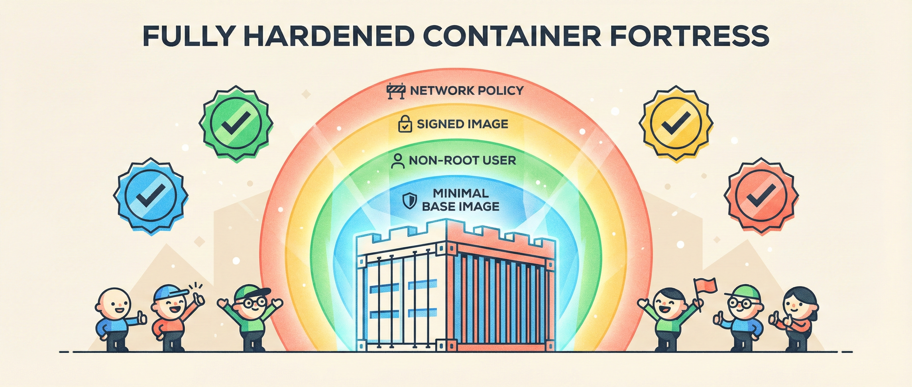

```dockerfile
# syntax=docker/dockerfile:1
FROM gcr.io/distroless/nodejs20-debian12:latest
COPY --chown=nonroot:nonroot --from=build /app /app
USER nonroot:nonroot
WORKDIR /app
ENTRYPOINT ["node", "server.js"]
```

Kubernetes manifest snippet:

```yaml
spec:
  securityContext:
    runAsNonRoot: true
    runAsUser: 65532
    fsGroup: 65532
    seccompProfile:
      type: RuntimeDefault
  containers:
  - name: app
    image: ghcr.io/org/app@sha256:3abc…
    securityContext:
      allowPrivilegeEscalation: false
      readOnlyRootFilesystem: true
      capabilities:
        drop: ["ALL"]
    resources:
      limits:
        memory: "256Mi"
        cpu: "500m"
```

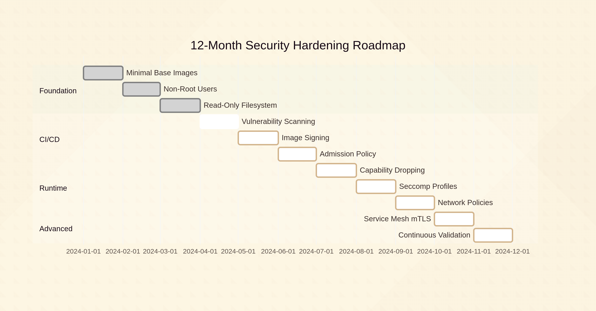

***

## Key Takeaways (CTO Cheat Sheet)

1. **Minimal base** → smaller blast radius.
2. **Non-root + read-only FS** → blocks 90 % of breakout scripts.
3. **Scan in CI, sign images, enforce admission** → tamper-proof supply chain.
4. **Drop capabilities + seccomp** → kernel exploits become **much** harder.
5. **NetworkPolicy + mTLS** → lateral movement dies at the first hop.
6. **Automate, then verify**—red-team your own cluster every sprint.

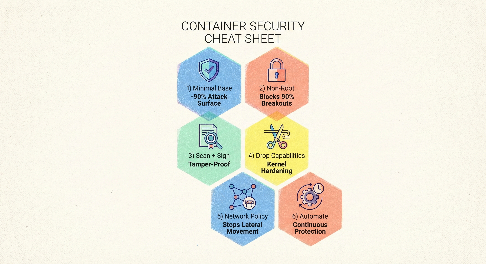

Implementing the full stack might feel daunting, but **each layer compounds**. Start with §1–3 this week, add scanning next sprint, and roll out NetworkPolicy the following. Twelve months from now, when the next zero-day drops, your pager will stay quiet—and your Docker containers will be the last target on the attacker’s list.

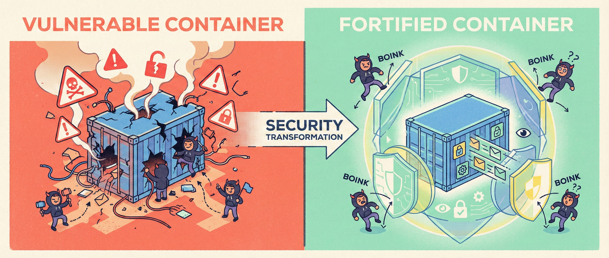