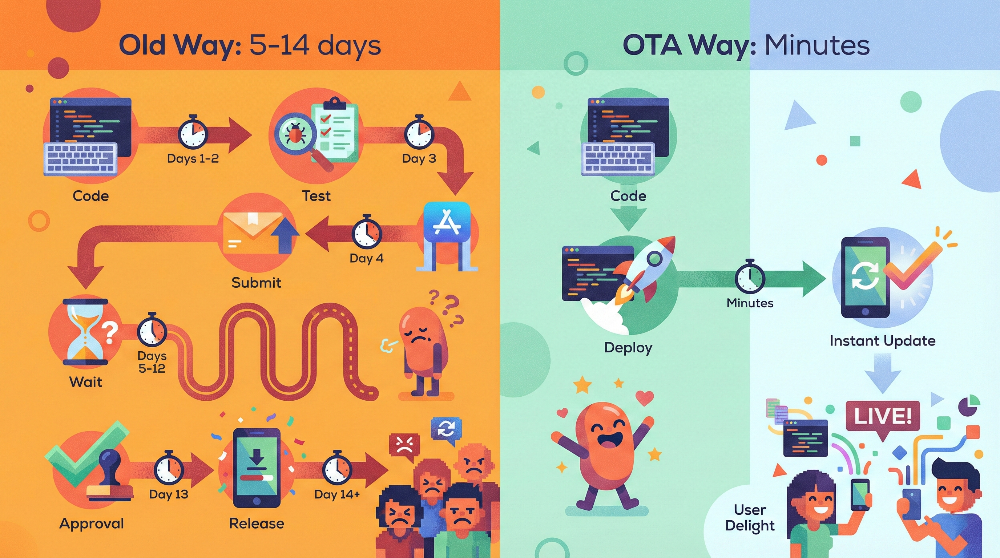
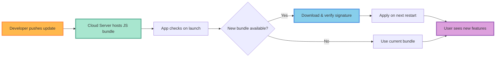
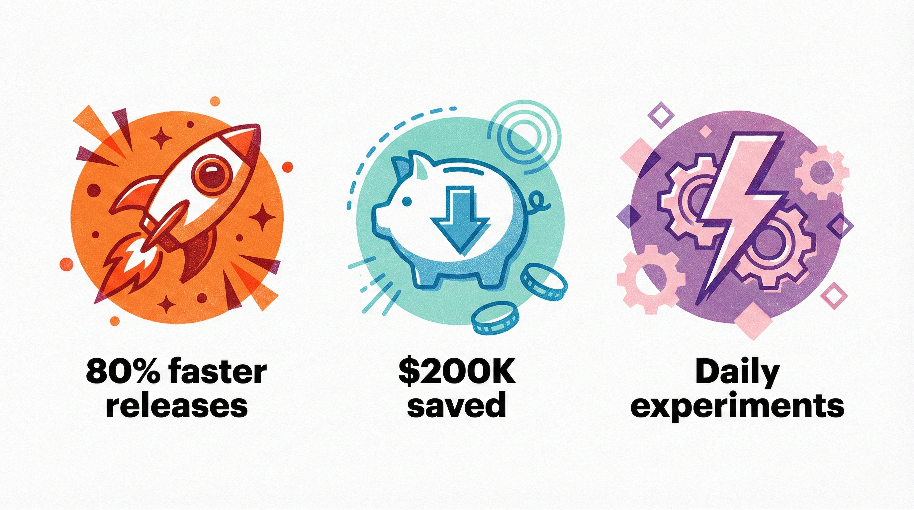
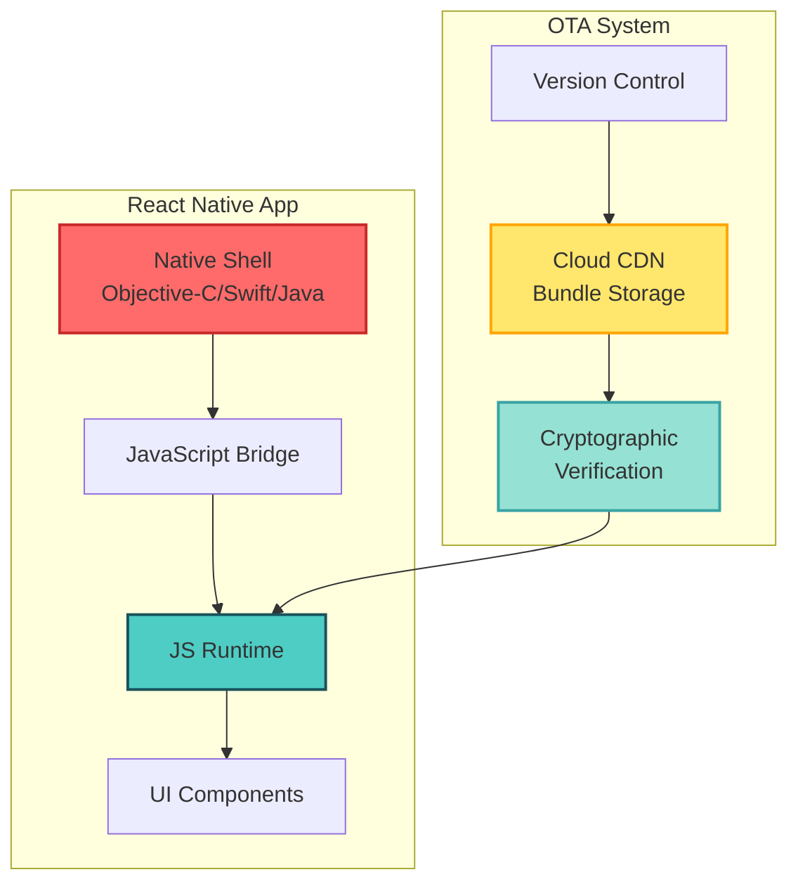
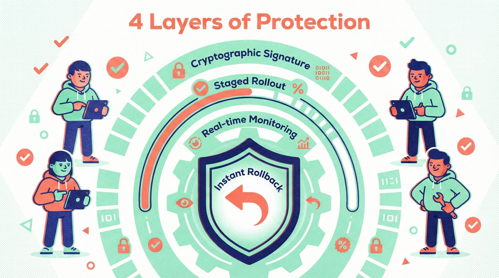
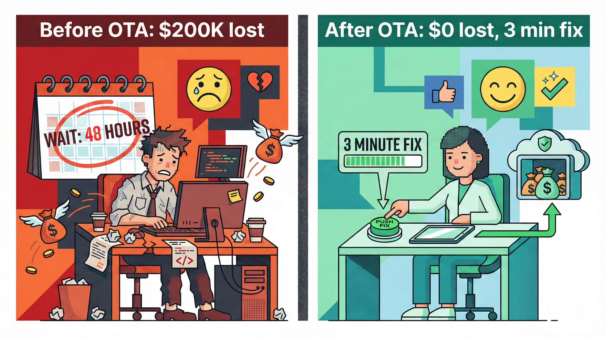
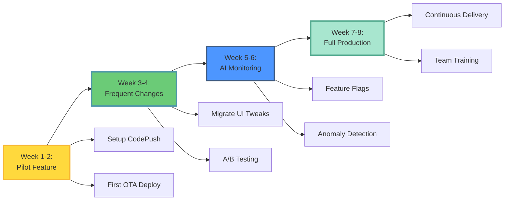
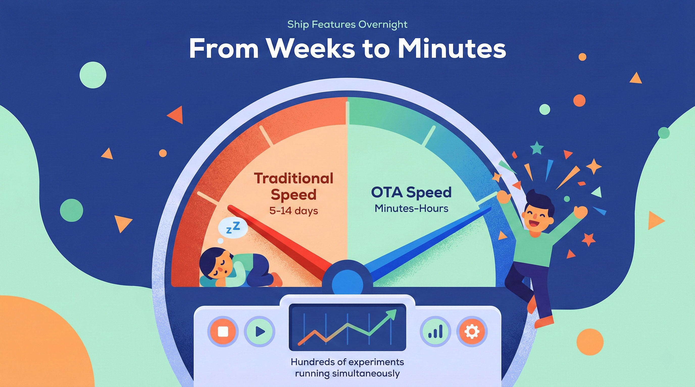

**How Instagram Ships New Features Overnight No App Store Update Required: A Deep-Dive into React-Native OTA Magic**

Your users crave new features. Your competitors move fast. But you're stuck waiting five days sometimes five weeks for Apple to approve your latest update. That waiting game isn't just frustrating. It's expensive. It kills momentum and hands your rivals the advantage.

Instagram doesn’t play that game. They ship fresh features to millions of users overnight, no app store required. Their secret? React-Native OTA updates. This isn’t future tech. It’s happening right now, and it’s reshaping how modern mobile teams think about release cycles.

Let’s unpack how this works, why it matters for your business, and how Aexaware Infotech helps startups and enterprises harness this same power.

---

### **Why Traditional App Updates Are Slowing You Down**

The old way feels rigid because it is. You write code, test it, bundle it, submit it, and wait. Apple’s review process can stretch from 24 hours to several weeks. Google Play moves faster, but you’re still looking at delays. Every minute of waiting costs you user engagement, revenue, and market relevance.

Worse, if you spot a critical bug post-release, you start the entire cycle again. Your users suffer. Your brand takes a hit. Your engineers feel helpless. This bottleneck makes true agility impossible. You can’t A/B test quickly. You can’t respond to user feedback in real time. You’re shipping on someone else’s schedule.

React-Native OTA updates flip this model on its head. They let you push JavaScript changes directly to users instantly, bypassing store approval entirely. The result? You control your release timeline.

---

### **What React-Native OTA Actually Does**

React-Native OTA stands for Over-the-Air updates in React Native apps. Think of it as a direct line from your server to your user’s device. When you publish a JavaScript bundle update, the app checks for it on launch, downloads the new code in the background, and applies it immediately.

The native shell your binary stays the same. Only the JavaScript logic and assets refresh. That means you can modify UI, fix bugs, or enable features without recompiling or resubmitting. Tools like Microsoft CodePush and Expo Updates make this process secure, reliable, and production-ready.

This isn’t a hack. It’s an architecture. Instagram, Facebook, Shopify, and Tesla use React-Native OTA to iterate at the speed of the web while delivering a native experience. Your team can do the same.

---

### **How Instagram Uses React-Native OTA to Ship Daily**

Instagram’s engineering team treats mobile releases like web deployments. They maintain a lean native core and push most changes through React-Native OTA. When they want to test a new Reels editing tool or tweak the feed algorithm, they push it to a percentage of users instantly.

If metrics look good, they ramp to 100% within hours. If something breaks, they roll back just as fast. No emergency app store submission. No panicked tweets. Just immediate control.

This approach lets them run hundreds of concurrent experiments. They learn faster, ship smarter, and keep users engaged with constant, subtle improvements. The competition can’t keep up because they’re still waiting for approval.

---

### **The Business Case: Speed, Cost, and Agility**

React-Native OTA delivers three clear wins. First, **speed**. You move from monthly releases to daily or hourly updates. Second, **cost savings**. Fewer emergency hotfixes mean less overtime and fewer crisis meetings. Third, **competitive agility**. You respond to market shifts while others are stuck in review queues.

For startups, this means validated learning on hyperdrive. For enterprises, it translates to lower risk and higher ROI on mobile investments. Your product team experiments freely. Your engineers focus on innovation, not bureaucracy. Your users stay happy.

Aexaware Infotech has seen clients cut release cycles by 80% and reduce critical bug resolution time from days to minutes. That’s not incremental improvement. That’s transformation.

---

### **Technical Deep-Dive: How OTA Updates Work Under the Hood**

Here’s the simple version. Your React Native app contains a native bridge and a JavaScript runtime. The native shell boots up, loads the JavaScript bundle, and renders your UI. With React-Native OTA, you host updated bundles on a cloud service.

On startup, the app checks for a new bundle. If one exists, it downloads, verifies the cryptographic signature, and caches it. The next launch uses the new code. You control the update policy force immediate reload, defer to next restart, or prompt the user.

Critical caveat: you can’t update native code this way. Changing Objective-C, Swift, Java, or Kotlin still requires a store submission. But 90% of typical feature work lives in JavaScript. That’s your freedom zone.

Aexaware’s DevOps engineers architect robust pipelines that automate this process, so your team presses “deploy” and watches updates flow safely to users worldwide.

---

### **Security and Best Practices You Can Trust**

Security concerns stop many teams from adopting React-Native OTA. That’s smart. You should never push unverified code. Reputable OTA services sign every update. Your app verifies that signature before applying anything.

Best practices matter. Always test on staging devices. Use feature flags to roll out gradually. Monitor crash rates in real time. Have an instant rollback plan. These aren’t optional extras they’re core requirements.

Aexaware Infotech bakes these guardrails into every implementation. We pair React-Native OTA with automated testing, CI/CD pipelines, and AI-powered monitoring. You get speed without sacrificing stability.

---

### **Real-World Impact: A E-Commerce Case Study**

One of our clients, a fast-growing e-commerce platform, struggled with flash sale bugs. A pricing error during Black Friday meant a 48-hour wait for a fix. By the time Apple approved the update, they’d lost $200,000 in margin.

We migrated their checkout flow to React Native and implemented OTA updates. Six months later, a similar bug appeared. They fixed it in three minutes. The patch reached all users within an hour. Total revenue impact? Zero.

Their release cycle dropped from three weeks to two days. Their team now ships experiments weekly. Their users enjoy a constantly improving app. That’s the power of React-Native OTA in action.

---

### **How Aexaware Infotech Makes This Easy**

You don’t need Facebook’s engineering headcount to ship like Instagram. You need the right partner.

Aexaware Infotech brings deep expertise in React Native, DevOps automation, and AI-driven quality assurance. We audit your current architecture, identify what can move to OTA, and build a migration roadmap. We handle the native foundations, the CI/CD pipeline, and the monitoring stack. Your team focuses on building features users love.

We’ve helped startups launch MVPs in eight weeks and helped enterprises modernize legacy apps without disrupting operations. Our AI-powered testing frameworks catch issues before they reach production. Our DevOps automation ensures every OTA update deploys safely.

Whether you need a full-scale implementation or a proof-of-concept, we meet you where you are.

---

### **Your Roadmap to OTA-Powered Releases**

Start small. Pick one non-critical feature. Migrate it to React Native. Set up a CodePush channel. Deploy an update. Measure the results. This pilot proves value fast.

Next, identify your most frequent change areas UI tweaks, content updates, A/B tests. Move those to OTA. Keep your native core stable. Gradually expand.

Finally, integrate AI monitoring to detect anomalies automatically. Add feature flags for granular control. You now ship continuously, safely, and confidently.

Aexaware guides you through each step. We train your team, document everything, and leave you with a system you own. No lock-in. Just capability.

---

### **Speed Is the New Standard**

The app stores aren’t going away. But they no longer control your velocity. React-Native OTA gives you the freedom to ship when you’re ready, fix issues instantly, and learn from users in real time. Instagram proved it. Shopify scaled it. Your team can master it.

Aexaware Infotech exists to make that transition seamless. We combine mobile expertise, DevOps excellence, and AI innovation to turn OTA magic into your competitive advantage.

Ready to stop waiting and start shipping?

**Let’s talk.** Aexaware Infotech is your innovation partner for scalable digital solutions. Connect with us today to explore how React-Native OTA can transform your mobile strategy.
