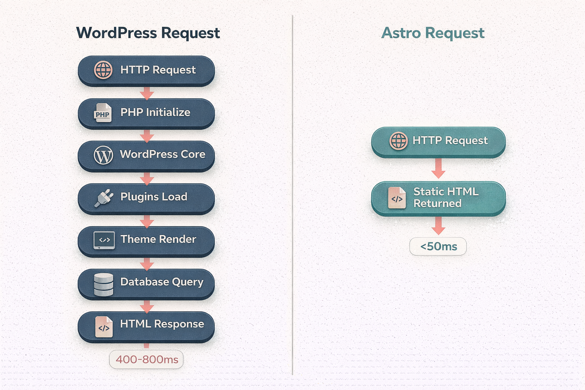
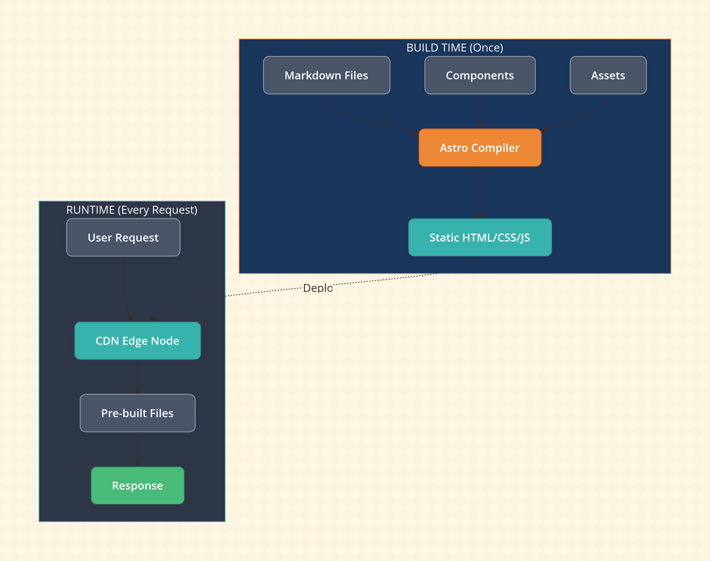
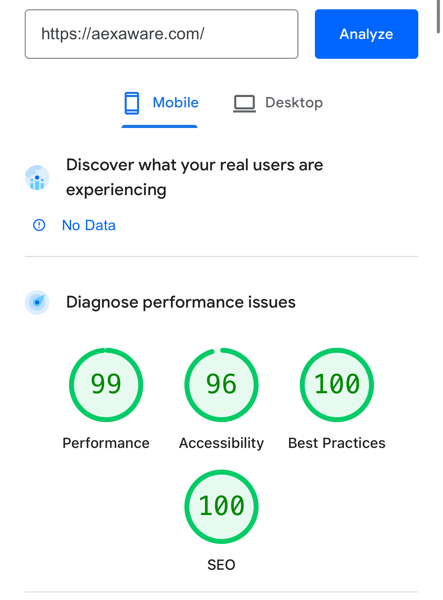
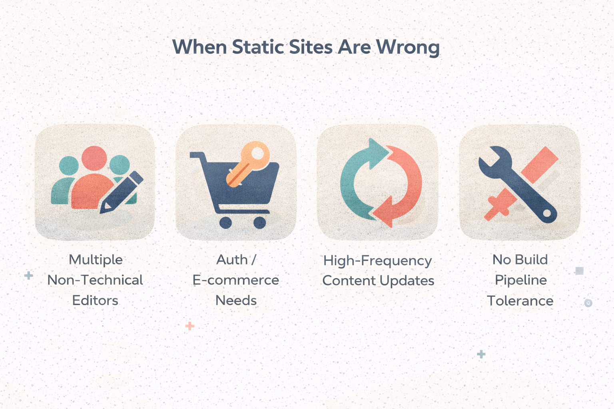
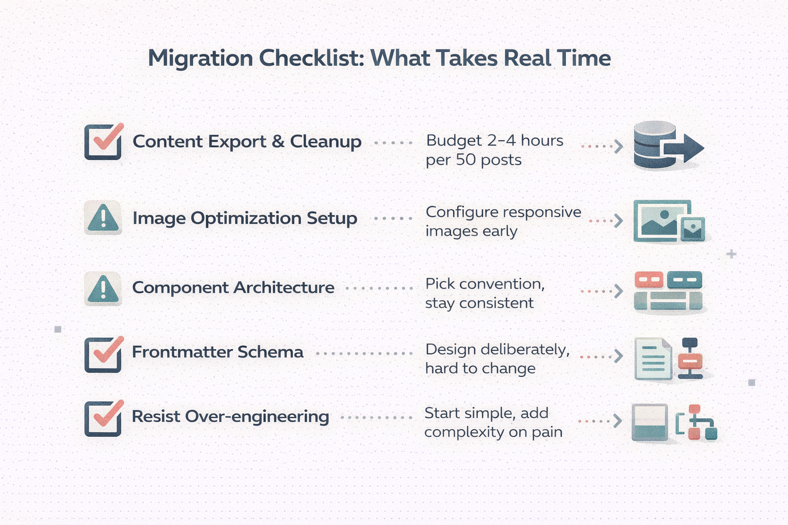
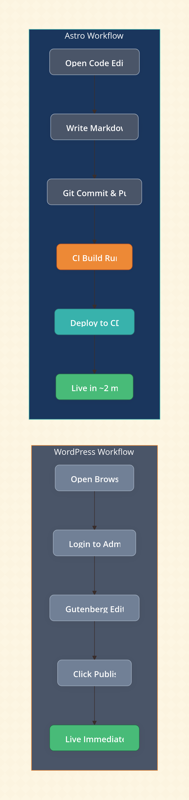

## The Real Problem

WordPress is doing too much for sites that need very little.

I ran my personal site on WordPress for years. Blog posts, a few static pages, contact info. The content changed maybe twice a month. Yet every page request meant PHP execution, database queries, plugin initialization, theme rendering, and all the associated I/O overhead.

My hosting bill wasn't dramatic, but it wasn't zero either. The site loaded in 2-3 seconds on a good day. I spent more time updating WordPress core, plugins, and PHP versions than actually writing content. Every update cycle introduced a nonzero risk of breaking something.

The architecture was fundamentally mismatched to the workload. I was running a dynamic content management system for what was essentially a collection of static documents.

## What Most Explanations Miss

The typical "WordPress vs static site generator" comparison focuses on speed benchmarks and feature lists. That misses the actual engineering problem.

WordPress isn't slow because it's badly written. It's slow because it's solving a different problem. WordPress assumes content changes frequently, multiple authors need access, and the site structure is unknown at build time. For that use case, server-side rendering with a database makes sense.

Most migration articles also overstate the simplicity of static sites. Yes, the output is simple. The build process and content workflow are not. You're trading runtime complexity for build-time complexity and development overhead. Whether that trade-off works depends entirely on your constraints.

The "greener" claim also needs scrutiny. Static sites reduce server compute per request, but the environmental impact depends on hosting infrastructure, caching behavior, and actual traffic patterns. For a low-traffic personal site, the carbon difference is negligible. The real gains are operational, not ecological.

## How It Actually Works

Astro is a static site generator with a component model. You write pages using a mix of Astro's templating syntax, Markdown, and optionally components from React, Vue, Svelte, or others. At build time, Astro compiles everything into plain HTML, CSS, and JavaScript.

The key architectural difference from WordPress:

**WordPress request flow:**

1. HTTP request hits server
2. PHP process initializes
3. WordPress core loads
4. Active plugins initialize
5. Theme loads
6. Database queries execute for content
7. PHP renders HTML
8. Response sent

Every step adds latency. Every step consumes server resources.

**Astro request flow:**

1. HTTP request hits CDN edge node
2. Pre-built HTML file returned

There's no server-side processing. The compute happened once, at build time, on your local machine or CI pipeline.

Astro's "zero JavaScript by default" approach means the client receives only what you explicitly include. WordPress themes and plugins routinely ship jQuery, multiple analytics scripts, form handlers, and framework code regardless of whether a specific page needs them.

For deployment, I use Cloudflare Pages. Push to git, build runs automatically, static assets deploy to edge nodes globally. No servers to manage, no PHP versions to track, no database backups.

## Trade-offs and Constraints

**What you gain:**

Performance is dramatic. My Lighthouse scores went from mid-70s to 99/96/100/100 (Performance/Accessibility/Best Practices/SEO). Time to first byte dropped from 400-800ms to under 50ms consistently. This isn't optimization—it's removing unnecessary work.

Hosting cost dropped to zero. Cloudflare Pages, Netlify, and Vercel all offer free tiers that handle personal site traffic easily. WordPress required either managed hosting ($10-30/month) or self-managed VPS ($5-10/month plus maintenance time).

Security surface area collapsed. No PHP vulnerabilities, no plugin exploits, no SQL injection vectors, no admin panel to brute force. Static files served from a CDN have an extremely limited attack surface.

**What you lose:**

Content editing workflow. WordPress has Gutenberg, media library, draft management, scheduled publishing, revision history. Astro has text files. If you're comfortable with Markdown and git, this is fine. If you have non-technical content contributors, this is a dealbreaker.

Dynamic functionality requires external services. Comments need something like Giscus or a third-party service. Forms need a serverless function or form service. Search needs client-side indexing or an external API. Each dynamic feature becomes an integration project.

Build time exists. Changes aren't instant. Push, wait for build, wait for deployment. For my site this is under two minutes. For large content sites, this can become painful.

**When this is a bad idea:**

If content updates frequently by multiple people who don't write code, WordPress or a headless CMS makes more sense. If you need user authentication, e-commerce, or significant dynamic behavior, a static site generator adds complexity rather than removing it. If you're not willing to maintain a build pipeline and deployment configuration, the operational simplicity of managed WordPress hosting might actually be lower friction.

## Practical Insights

The migration itself was the hardest part. WordPress stores content in a database with its own formatting conventions. Extracting clean Markdown required manual cleanup. Plugins exist to export content, but the output quality varies. Budget real time for this.

Image handling needs thought upfront. WordPress automatically generates multiple sizes and serves responsive images. In Astro, you need to configure this explicitly using `@astrojs/image` or similar. Get this right early or you'll ship unoptimized images.

The component model is powerful but creates decision overhead. Should this be an Astro component, a React component, or just HTML? There's no single right answer, but inconsistency creates maintenance burden. Pick a convention and stick with it.

Markdown frontmatter becomes your content schema. Design it deliberately. Changing your frontmatter structure later means updating every content file.

Don't over-engineer the initial build. Astro supports a lot of complexity—content collections, dynamic routes, API endpoints, SSR mode. For a personal site, you probably need none of this. Start simple, add complexity only when you feel pain.

## Closing Thought

The right architecture is the one where your system's complexity matches your problem's complexity. Running a database-backed CMS for a site that updates twice a month is carrying weight you don't need. The performance gains from switching to static generation aren't about clever optimization—they're about removing work that shouldn't happen in the first place.